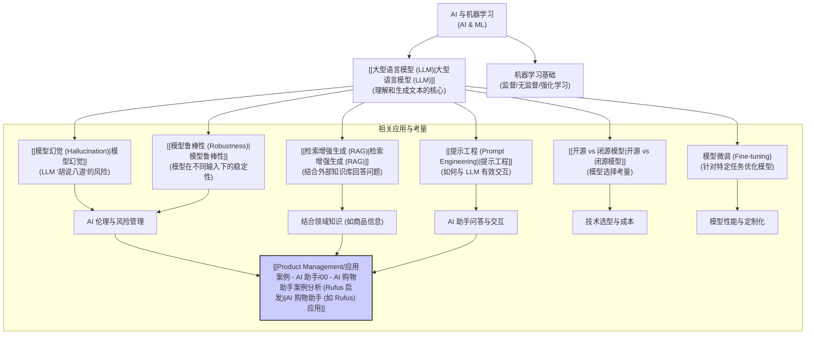

# AI 与机器学习概览

## 概述

人工智能 (Artificial Intelligence, AI) 是计算机科学的一个分支，旨在创造能够模拟人类智能行为的机器或系统，例如学习、解决问题、理解语言、感知环境和做出决策。

机器学习 (Machine Learning, ML) 是实现人工智能的一种核心方法。它使计算机系统能够**从数据中学习**规律和模式，而无需进行显式编程。

对于理解像 Amazon Rufus 这样的 AI 购物助手，掌握一些核心的 AI/ML 概念至关重要。本文件夹旨在介绍与 AI 产品经理面试相关的关键技术概念。

## 核心概念地图

## 主要概念入口

*   [[大型语言模型 (LLM)|大型语言模型 (LLM)]]
*   [[提示工程 (Prompt Engineering)|提示工程 (Prompt Engineering)]]
*   [[模型幻觉 (Hallucination)|模型幻觉 (Hallucination)]]
*   [[模型鲁棒性 (Robustness)|模型鲁棒性 (Robustness)]]
*   [[检索增强生成 (RAG)|检索增强生成 (RAG)]]
*   [[开源 vs 闭源模型|开源 vs 闭源模型]]

## 学习建议

对于 AI 产品经理面试，重点在于理解这些概念的**含义、应用场景、优缺点以及它们对产品设计和业务的影响**。不需要深入到算法细节，但需要能够清晰地解释这些概念，并讨论它们在 AI 助手这类产品中的实际应用和挑战。

## 相关产品管理概念

*   [[04 - 技术与实现|技术与实现 (完整框架)]]
*   [[Product Management/基础概念/风险管理|风险管理]] (尤其是 AI 相关的风险)
*   [[功能优先级排序|功能优先级排序]] (考虑技术可行性)
