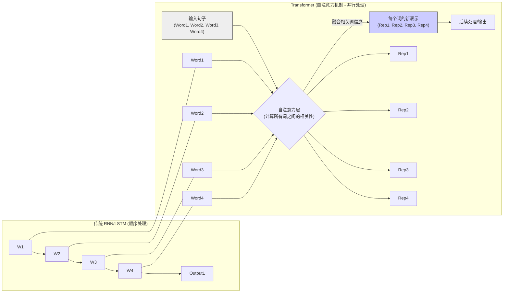

# Transformer 模型架构

[[../00 - AI 与机器学习概览|返回 AI 概览]] | [[../大型语言模型 (LLM)|LLM 基础]]

## 概述

Transformer 是一种**深度学习模型架构**，由 Google 在 2017 年的论文《Attention Is All You Need》中提出。它最初用于机器翻译任务，但其核心机制——**自注意力 (Self-Attention)**——被证明在处理各种序列数据（尤其是自然语言文本）方面非常强大，从而**彻底改变了[[../大型语言模型 (LLM)|自然语言处理 (NLP)]]领域**。

**几乎所有现代的[[../大型语言模型 (LLM)|大型语言模型 (LLM)]]（如 GPT、BERT、LLaMA、Claude 等）都是基于 Transformer 架构构建的。** 理解 Transformer 的核心思想有助于理解 LLM 为何如此强大。

## 核心思想：注意力机制 (Attention Mechanism)

在 Transformer 出现之前，处理序列数据（如句子）的主流模型是 RNN (循环神经网络) 和 LSTM/GRU (长短期记忆网络/门控循环单元)。这些模型按顺序处理单词，难以捕捉句子中**相距较远的词语之间的依赖关系**（例如，“法律” 和 “规定” 在长句中的关联），并且难以**并行计算**（必须处理完前一个词才能处理下一个）。

Transformer 架构通过**注意力机制 (Attention Mechanism)**，特别是**自注意力 (Self-Attention)**，解决了这些问题：

1.  **同时关注所有词**: 对于句子中的**每一个词**，自注意力机制会计算它与句子中**所有其他词**（包括它自己）的**相关性或“注意力权重”**。
2.  **加权表示**: 基于这些权重，模型为每个词生成一个新的表示 (Representation)，这个表示融合了句子中所有与之相关词语的信息。**相关性越强的词，其信息对当前词新表示的贡献越大。**
3.  **捕捉长距离依赖**: 由于模型可以直接计算任意两个词之间的相关性，无论它们在句子中相距多远，因此能够有效捕捉长距离依赖关系。
4.  **并行计算**: 每个词的新表示可以**独立并行计算**，大大提高了训练效率。

> [!info] 直观理解
想象一下你在阅读一个长句子：“**苹果**公司昨天发布了新款 **iPhone**，它具有更强的**处理器**和改进的**摄像头**。” 当模型处理 “iPhone” 这个词时，自注意力机制能让它同时关注到 “苹果”（知道是谁发布的）、“处理器”和“摄像头”（知道是 iPhone 的特性），即使这些词语在句子中位置不同。

## Transformer 的主要组成部分 (简化)

*   **[[../Core Technologies/嵌入 (Embedding)|词嵌入 (Embeddings)]]**: 将输入的单词转换为向量表示。
*   **位置编码 (Positional Encoding)**: 由于 Transformer 并行处理，本身没有顺序信息，需要加入位置编码来告诉模型单词在句子中的位置。
*   **多头自注意力 (Multi-Head Self-Attention)**: 同时从不同角度（不同的“头”）计算注意力权重，捕捉更丰富的依赖关系。
*   **前馈神经网络 (Feed-Forward Networks)**: 在注意力层之后对每个位置的表示进行进一步处理。
*   **层归一化 (Layer Normalization) & 残差连接 (Residual Connections)**: 帮助模型训练更稳定、更深入。
*   **编码器 (Encoder) & 解码器 (Decoder)**:
    *   原始 Transformer 包含编码器（理解输入序列）和解码器（生成输出序列），适用于机器翻译等 Seq2Seq 任务。
    *   许多 LLM（如 GPT 系列）主要使用**解码器**部分 (Decoder-only)，专注于根据前面的文本生成后续文本。
    *   有些模型（如 BERT）主要使用**编码器**部分 (Encoder-only)，专注于理解文本，适用于文本分类、命名实体识别等任务。

## 对产品经理的意义

*   **理解能力基础**: Transformer 的注意力机制是 LLM 能够理解上下文、把握语义关系、处理长文本的关键。
*   **生成能力基础**: 基于 Transformer 的解码器架构使得 LLM 能够流畅地生成连贯的文本。
*   **效率与规模**: Transformer 的并行计算能力使得训练更大规模的模型成为可能，从而带来了能力的涌现。
*   **局限性提示**: 理解其基于模式匹配和概率生成，有助于理解[[../模型幻觉 (Hallucination)|幻觉]]等局限性的来源（它不具备真正的逻辑推理或世界模型）。

## 总结

Transformer 架构及其核心的自注意力机制是理解现代 [[../大型语言模型 (LLM)|LLM]] 工作原理的基础。产品经理不需要深入了解其数学细节，但理解其**核心思想（如何通过注意力捕捉依赖关系）**以及**它带来的优势（处理长距离依赖、并行计算）**，对于理解 LLM 的能力边界、评估相关技术方案非常有帮助。

## 相关概念

*   [[../大型语言模型 (LLM)|大型语言模型 (LLM)]]
*   [[注意力机制]]
*   [[自注意力]]
*   [[../Core Technologies/嵌入 (Embedding)|嵌入 (Embedding)]]
*   [[自然语言处理 (NLP)]]
*   [[深度学习]]
*   [[编码器-解码器架构]]
