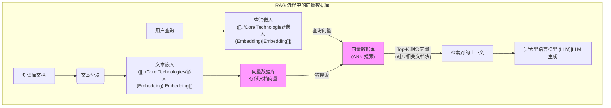

# 向量数据库 (Vector Database)

[[../00 - AI 与机器学习概览|返回 AI 概览]] | [[../Core Technologies/嵌入 (Embedding)|相关: 嵌入 (Embedding)]] | [[../检索增强生成 (RAG)|相关: RAG]]

## 概述

向量数据库是一种**专门设计用于存储、索引和高效查询高维[[../Core Technologies/嵌入 (Embedding)|嵌入向量 (Embedding Vectors)]]** 的数据库。

随着[[../Core Technologies/嵌入 (Embedding)|Embedding]]技术在 AI 领域的广泛应用（用于表示文本、图像、音频等的语义信息），如何快速地在海量向量中找到与给定查询向量**最相似**的向量（即[[近似最近邻搜索 (Approximate Nearest Neighbor, ANN)]]）成为了一个关键需求。传统的关系型数据库或文档数据库并不擅长处理这种高维向量的相似性搜索。向量数据库应运而生，填补了这一空白。

## 核心功能：相似性搜索

向量数据库的核心能力是**高效的相似性搜索 (Similarity Search)**。当给定一个查询向量时（例如，用户问题的[[../Core Technologies/嵌入 (Embedding)|嵌入]]），向量数据库能够快速地从数百万甚至数十亿的向量中，找出在向量空间中与其**距离最近**（即语义最相似）的 K 个向量（K-Nearest Neighbors, KNN）。

> [!info]+ 直观理解：在向量空间中寻找近邻
想象一个存储了大量文档（每个文档表示为一个点/向量）的 3D 空间。当一个新的查询（也表示为一个点/向量）进来时，向量数据库的任务就是快速找到离这个查询点最近的几个点（文档向量）。

```tikz
\documentclass{standalone}
\usepackage{pgfplots}
\pgfplotsset{compat=1.16}

\begin{document}
\begin{tikzpicture}[scale=3]

% Axes
\draw[->] (-1.2,0)--(1.2,0) node[right,font=\small] {$X_1$};
\draw[->] (0,-1.2)--(0,1.2) node[above,font=\small] {$X_2$};

% Database vectors (explicit coordinates)
\fill[gray!50] (0.8,0.7) circle(0.02);
\fill[gray!50] (0.7,0.8) circle(0.02);
\fill[gray!50] (0.9,0.5) circle(0.02);
\fill[gray!50] (-0.8,-0.9) circle(0.02);
\fill[gray!50] (-0.9,-0.8) circle(0.02);
\fill[gray!50] (0.1,0.9) circle(0.02);
\fill[gray!50] (-0.5,0.6) circle(0.02);
\fill[gray!50] (0.4,-0.8) circle(0.02);
\fill[gray!50] (-0.2,-0.1) circle(0.02);

% Query vector (simple red dot)
\fill[red] (0.3,0.4) circle(0.03);
\node[red,font=\small,right] at (0.3,0.4) {Query};

% Nearest neighbors (KNN) clearly marked
\draw[blue,thick] (0.8,0.7) circle(0.04);
\draw[blue,thick] (0.7,0.8) circle(0.04);
\draw[blue,thick] (0.9,0.5) circle(0.04);

% Connecting lines explicitly drawn
\draw[blue,->] (0.3,0.4)--(0.8,0.7);
\draw[blue,->] (0.3,0.4)--(0.7,0.8);
\draw[blue,->] (0.3,0.4)--(0.9,0.5);

% Legend (simplified)
\node[gray,font=\small,right] at (1,-0.9) {Database};
\node[blue,font=\small,right] at (1,-1.0) {KNN neighbors};

\end{tikzpicture}
\end{document}

```
上图示意了向量数据库的核心功能：给定一个红色的查询向量 (Query Vector)，系统快速地在众多灰色的数据库向量中找到与其最相似（空间距离最近）的 K 个向量（图中 K=3，用蓝色圆圈标出），这些最近邻向量通常对应着最相关的文档或信息。

常用的相似度/距离度量包括：
*   **[[余弦相似度 (Cosine Similarity)]]**: 衡量向量方向的相似性，常用于文本嵌入。
*   **[[欧氏距离 (Euclidean Distance)]]**: 衡量向量空间中的直线距离。
*   **点积 (Dot Product)**

为了实现**快速**搜索，向量数据库通常采用**[[近似最近邻搜索 (ANN)]]** 算法（如 HNSW, LSH, IVF 等），这些算法能在可接受的精度损失范围内，极大地提升搜索速度。

## 为什么需要向量数据库？(尤其对于 RAG)

向量数据库是实现高效[[../检索增强生成 (RAG)|检索增强生成 (RAG)]]系统的**关键基础设施**：

1.  **存储知识库向量**: [[../检索增强生成 (RAG)|RAG]] 需要将外部知识库（文档、网页等）分割成块 (Chunks)，并将每个块转换为[[../Core Technologies/嵌入 (Embedding)|嵌入向量]]存储起来。向量数据库提供了存储这些海量向量的场所。
2.  **快速语义检索**: 当用户提问时，RAG 需要将用户问题也转换为[[../Core Technologies/嵌入 (Embedding)|嵌入向量]]，然后在知识库向量中快速找到语义最相关的几个文档块作为[[../检索增强生成 (RAG)|上下文]]。向量数据库的 ANN 搜索能力使得这一步非常高效。
3.  **可扩展性**: 能够处理不断增长的向量数据。
4.  **元数据过滤**: 通常支持在向量搜索的同时，根据元数据（如文档来源、时间戳、类别标签）进行过滤，提高检索的精确性。



## 常见的向量数据库

*   **专用向量数据库**: Pinecone, Weaviate, Milvus, Qdrant, Chroma DB 等。它们专门为向量存储和搜索而设计优化。
*   **现有数据库扩展**: PostgreSQL (通过 pgvector 扩展), Elasticsearch, Redis 等也增加了向量搜索功能，但可能在性能和功能上与专用库有差异。

## 对产品经理的意义

*   **理解 RAG 技术栈**: 知道向量数据库是实现高效 RAG 的关键组件。
*   **评估技术方案**: 在讨论需要语义搜索或 RAG 功能的产品时，能够理解引入向量数据库的必要性和相关考量（如选型、成本、性能）。
*   **数据管理考量**: 考虑知识库的构建、[[../Core Technologies/嵌入 (Embedding)|Embedding]] 生成、向量数据库的维护和更新策略。
*   **性能与成本权衡**: 不同的向量数据库或 ANN 算法在搜索速度、精度、内存消耗、成本等方面有不同的权衡。

## 总结

向量数据库是 AI 应用（特别是涉及[[../Core Technologies/嵌入 (Embedding)|Embedding]]和语义相似性搜索的应用，如[[../检索增强生成 (RAG)|RAG]]）的重要基础设施。它使得在大规模向量数据中进行快速、高效的相似性搜索成为可能。产品经理理解其作用和价值，有助于更好地规划和设计依赖语义理解和检索能力的 AI 产品。

## 相关概念

*   [[../Core Technologies/嵌入 (Embedding)|嵌入 (Embedding)]]
*   [[向量 (Vector)]]
*   [[相似性搜索]]
*   [[近似最近邻搜索 (ANN)]]
*   [[../检索增强生成 (RAG)|检索增强生成 (RAG)]]
*   [[信息检索]]
*   [[数据库]]
*   [[机器学习]]
