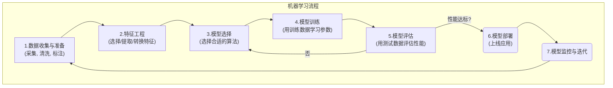
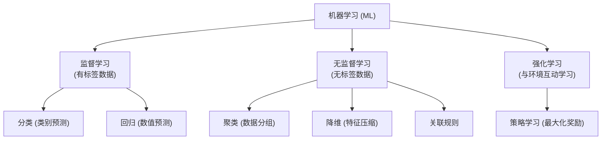

# 机器学习 (Machine Learning - ML)

[[00 - AI 与机器学习概览|返回 AI 概览]]

## 概述

机器学习 (Machine Learning, ML) 是人工智能 (AI) 的一个核心子领域，专注于研究如何让计算机系统**利用数据来提高其在特定任务上的性能，而无需进行显式编程**。简单来说，就是让机器具备从经验（数据）中“学习”的能力。

传统编程是人告诉机器**如何**做（明确的规则和指令），而机器学习是人给机器提供**数据**和**目标**，让机器自己**学习如何**做。

## 机器学习的基本流程 (简化)

1.  **数据收集与准备**: 获取相关数据，进行清洗（处理缺失值、异常值）、标注（如果需要监督学习）。
2.  **特征工程**: 从原始数据中选择、提取或转换出对模型学习有帮助的特征 (Features)。(在[[深度学习|深度学习]]中，特征工程的重要性有所降低，模型能自动学习特征)。
3.  **模型选择**: 根据任务类型（分类、回归、聚类等）和数据特点，选择合适的机器学习算法（如[[线性回归]]、[[逻辑回归]]、[[决策树]]、[[支持向量机 (SVM)]]、[[神经网络]]等）。
4.  **模型训练**: 将准备好的训练数据输入给选定的模型算法，算法会自动调整内部参数，以最小化预测错误或达成特定目标。
5.  **模型评估**: 使用未参与训练的测试数据来评估模型的性能，常用的[[../AI & ML/Evaluation/评估指标 (Evaluation Metrics)|评估指标]]包括准确率、精确率、召回率、F1 分数、AUC 等（取决于任务）。
6.  **模型部署**: 将训练好的、性能达标的模型部署到实际应用中，对外提供预测或决策服务。
7.  **模型监控与迭代**: 持续监控模型在线上的表现，收集新数据，根据需要重新训练或更新模型。

## 机器学习的主要类型

根据学习方式和数据类型的不同，机器学习主要分为：

1.  **监督学习 (Supervised Learning)**:
    *   **特点**: 使用**带有标签 (Labeled)** 的数据进行训练。模型学习从输入特征到已知输出标签之间的映射关系。
    *   **任务**:
        *   **分类 (Classification)**: 预测输入属于哪个预定义的类别（例如：判断邮件是否为垃圾邮件，识别图像中的猫或狗）。
        *   **回归 (Regression)**: 预测一个连续的数值（例如：预测房价，预测股票价格）。
2.  **无监督学习 (Unsupervised Learning)**:
    *   **特点**: 使用**没有标签**的数据进行训练。模型需要自己发现数据中的结构、模式或关系。
    *   **任务**:
        *   **聚类 (Clustering)**: 将相似的数据点分组（例如：用户分群）。
        *   **降维 (Dimensionality Reduction)**: 减少数据的特征数量，同时保留重要信息（例如：[[主成分分析 (PCA)]]）。
        *   **关联规则挖掘**: 发现数据项之间的关联性（例如：“购买啤酒的人也倾向于购买尿布”）。
3.  **强化学习 (Reinforcement Learning - RL)**:
    *   **特点**: 模型（称为智能体 Agent）通过与**环境 (Environment)** 互动来学习。智能体执行**动作 (Action)**，环境给出**奖励 (Reward)** 或惩罚，智能体的目标是学习一个**策略 (Policy)** 来最大化累积奖励。
    *   **应用**: [[游戏 AI]] (如 AlphaGo), [[机器人控制]], [[推荐系统]] 优化等。RLHF (人类反馈强化学习) 被用于[[../微调 (Fine-tuning)|微调]] [[../大型语言模型 (LLM)|LLM]] 以更好地遵循指令。

## 对产品经理的意义

*   **理解 AI 能力来源**: 知道机器学习是当前 AI 能力的主要来源，是数据驱动的。
*   **评估可行性**: 对一个 AI 功能需求，能初步判断它属于哪种机器学习任务，大致了解其实现难度和对数据的要求（例如，监督学习需要大量标注数据）。
*   **数据重要性**: 深刻理解数据质量和数量对机器学习模型效果的决定性作用（Garbage In, Garbage Out）。
*   **沟通协作**: 能与数据科学家、ML 工程师就模型目标、评估指标、数据需求等进行有效沟通。
*   **关注模型评估与迭代**: 理解模型需要持续评估和优化。

## 总结

机器学习是让机器从数据中学习的核心技术。理解其基本流程、主要类型（监督、无监督、强化）及其典型任务，有助于产品经理更好地理解 AI 产品的底层逻辑，评估需求可行性，并认识到数据在 AI 产品开发中的关键作用。

## 相关概念

*   [[人工智能 (AI)]]
*   [[深度学习|深度学习]] (ML 的一个分支)
*   [[数据 (Data)]]
*   [[特征工程]]
*   [[模型训练]]
*   [[模型评估]]
*   [[../AI & ML/Evaluation/评估指标 (Evaluation Metrics)|评估指标]]
*   [[监督学习]]
*   [[无监督学习]]
*   [[强化学习 (RL)]]
*   [[分类 (Classification)]]
*   [[回归 (Regression)]]
*   [[聚类 (Clustering)]]
