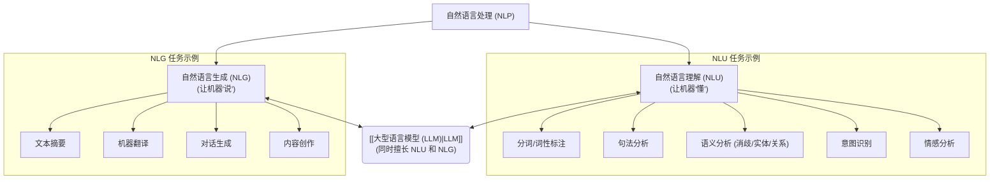

# 自然语言处理 (Natural Language Processing - NLP)

[[00 - AI 与机器学习概览|返回 AI 概览]]

## 概述

自然语言处理 (NLP) 是人工智能 (AI) 和语言学的一个交叉领域，专注于**使计算机能够理解、解释、处理和生成人类自然语言（如中文、英文）**。其目标是弥合人类交流方式与计算机理解能力之间的鸿沟。

NLP 是许多现代 AI 应用的基础，尤其是那些涉及文本或语音交互的应用，例如：
*   [[大型语言模型 (LLM)|大型语言模型 (LLM)]] 本身就是 NLP 领域取得突破性进展的成果。
*   [[应用案例 - AI 助手/00 - AI 购物助手案例分析 (Rufus 启发)|AI 助手]] / 聊天机器人
*   机器翻译
*   情感分析
*   文本摘要
*   信息抽取
*   语音识别 (通常与 NLP 结合)

## NLP 的主要任务

NLP 涵盖了广泛的任务，可以大致分为两大类：

1.  **自然语言理解 (Natural Language Understanding - NLU)**: 让计算机“读懂”人类语言。
    *   **[[词法分析]]**: 分词 (将句子切分成单词)、词性标注 (识别名词、动词等)。
    *   **[[句法分析]]**: 分析句子结构（主谓宾、依存关系）。
    *   **[[语义分析]]**: 理解单词和句子的含义，包括消歧（如“苹果”指水果还是公司？）、[[实体识别]]（识别人名、地名、组织名）、[[关系抽取]]（识别实体间的关系）。
    *   **[[意图识别]]**: 判断用户说话的意图（例如，是提问、抱怨还是下指令）。
    *   **[[情感分析]]**: 判断文本的情感倾向（正面、负面、中性）。
2.  **自然语言生成 (Natural Language Generation - NLG)**: 让计算机“说出”或“写出”人类语言。
    *   **文本规划**: 决定要表达哪些信息。
    *   **句子规划**: 将信息组织成合乎语法的句子结构。
    *   **文本实现**: 生成最终的自然语言文本。
    *   [[大型语言模型 (LLM)|LLM]] 在 NLG 方面表现尤为突出。

## NLP 技术的发展

*   **早期 (基于规则)**: 依赖语言学家手动编写大量语法规则和词典。效果有限，难以覆盖语言的复杂性和歧义性。
*   **统计 NLP**: 基于大规模语料库，使用[[机器学习]]（如 [[朴素贝叶斯]]、[[支持向量机 (SVM)]]、[[隐马尔可夫模型 (HMM)]]）学习语言的统计模式。比基于规则的方法效果更好，但仍依赖特征工程。
*   **[[深度学习]]时代**:
    *   [[嵌入 (Embedding)|词嵌入 (Word Embeddings)]] (Word2Vec, GloVe) 解决了词语的向量表示问题。
    *   RNN/LSTM 在序列建模上取得进展。
    *   **[[Transformer 模型|Transformer]] 架构 (2017)**: 带来了革命性突破，其[[自注意力]]机制能有效捕捉长距离依赖并支持并行计算，成为现代 NLP 的基石。
    *   **预训练语言模型 (Pre-trained Language Models, PLM)**: 如 BERT, GPT 等基于 [[Transformer 模型|Transformer]] 在海量数据上预训练的模型，只需少量[[微调 (Fine-tuning)|微调]]即可在各种下游 NLP 任务上取得优异效果，极大降低了应用门槛。
    *   **[[大型语言模型 (LLM)|大型语言模型 (LLM)]]**: 参数规模更大、能力更强的 PLM，展现出强大的理解和生成能力。

## 对产品经理的意义

*   **理解 AI 产品基础**: NLP 是理解许多 AI 产品（尤其是涉及文本交互的）工作原理的基础。
*   **定义产品需求**: 能够更准确地描述产品在理解用户输入（NLU）和生成响应（NLG）方面需要达到的能力水平。
*   **评估技术可行性**: 对 NLP 任务的难度有基本判断（例如，简单的意图识别 vs. 复杂的开放域对话）。
*   **沟通协作**: 能与 NLP 工程师使用共同语言交流。

## 总结

NLP 是使计算机能够处理人类语言的关键技术领域。从早期的规则方法到统计学习，再到如今由 [[Transformer 模型|Transformer]] 和 [[大型语言模型 (LLM)|LLM]] 引领的深度学习时代，NLP 取得了巨大进步。理解 NLP 的基本概念、主要任务和发展历程，有助于产品经理更好地设计和评估利用自然语言交互的 AI 产品。

## 相关概念

*   [[人工智能 (AI)]]
*   [[机器学习 (ML)]]
*   [[深度学习]]
*   [[大型语言模型 (LLM)|大型语言模型 (LLM)]]
*   [[Transformer 模型|Transformer 模型]]
*   [[嵌入 (Embedding)|嵌入 (Embedding)]]
*   [[自然语言理解 (NLU)]]
*   [[自然语言生成 (NLG)]]
*   [[应用案例 - AI 助手/00 - AI 购物助手案例分析 (Rufus 启发)|AI 助手]]
