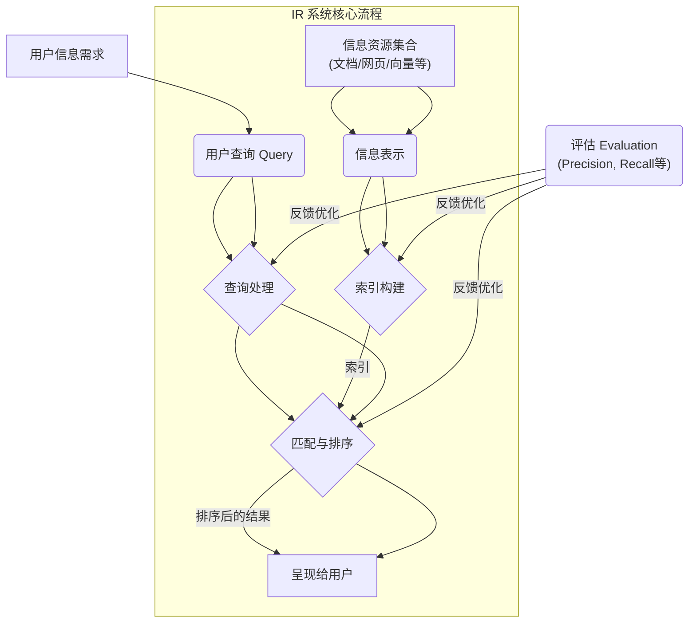

# 信息检索 (Information Retrieval - IR)

## 概述

信息检索 (Information Retrieval, IR) 是计算机科学的一个领域，专注于**从大规模的信息资源集合（通常是非结构化的，如文本文档、网页、图像）中查找满足用户特定信息需求的资料**的过程。

简单来说，IR 系统就是帮助用户**找到他们想要的信息**的系统。我们日常使用的**搜索引擎**（如 Google, Baidu）就是最典型的 IR 系统。

## IR 系统的核心任务

1.  **信息表示 (Representation)**: 如何将文档和用户查询表示成计算机可以处理的形式？
    *   传统方法：[[词袋模型 (Bag-of-Words)]], [[TF-IDF]] 向量。
    *   现代方法：[[AI & ML/Core Technologies/嵌入 (Embedding)|嵌入向量 (Embeddings)]] (来自 [[AI & ML/大型语言模型 (LLM)|LLM]] 或其他模型)。
2.  **索引 (Indexing)**: 如何组织和存储这些表示，以便能够快速查找？
    *   传统方法：[[倒排索引 (Inverted Index)]] (用于关键词搜索)。
    *   现代方法：[[AI & ML/Core Technologies/向量数据库|向量数据库]] / [[AI & ML/Information Retrieval/近似最近邻搜索 (ANN)|ANN 索引]] (用于语义搜索)。
3.  **查询处理 (Query Processing)**: 如何理解用户的查询意图，并将其转换为可用于检索的形式？
    *   [[查询扩展]], [[查询重写]]。
    *   将查询文本转换为[[AI & ML/Core Technologies/嵌入 (Embedding)|嵌入向量]]。
4.  **匹配与排序 (Matching & Ranking)**: 如何根据查询找到相关的文档，并按照相关性对结果进行排序？
    *   传统方法：基于关键词匹配度（如 BM25 算法）。
    *   现代方法：基于[[AI & ML/Information Retrieval/相似性搜索|向量相似度计算]]（如[[AI & ML/Information Retrieval/余弦相似度|余弦相似度]]）。
    *   通常会结合多种信号进行[[学习排序 (Learning to Rank)]]。
5.  **评估 (Evaluation)**: 如何衡量 IR 系统的性能？
    *   常用指标：[[精确率 (Precision)]], [[召回率 (Recall)]], F1-Score, MAP (Mean Average Precision), NDCG (Normalized Discounted Cumulative Gain)。

## IR 与 [[AI & ML/检索增强生成 (RAG)|RAG]] 的关系

[[AI & ML/检索增强生成 (RAG)|RAG]] 中的“检索 (Retrieval)”步骤，本质上就是一个**信息检索**过程。它利用 IR 技术（特别是基于[[AI & ML/Core Technologies/嵌入 (Embedding)|嵌入]]的[[AI & ML/Information Retrieval/相似性搜索|相似性搜索]]和[[AI & ML/Core Technologies/向量数据库|向量数据库]]）从外部知识库中找到与用户输入最相关的信息片段，作为[[AI & ML/大型语言模型 (LLM)|LLM]] 生成回答的上下文。

可以说，**高效、精准的 IR 是 RAG 系统成功的关键前提**。

## 对产品经理的意义

*   **理解搜索与问答基础**: 了解用户查找信息的基本过程和技术原理。
*   **评估 RAG 方案**: 明白 RAG 系统的效果很大程度上取决于其底层 IR 组件的性能（检索的准确性、召回率、速度）。
*   **定义搜索/问答需求**: 能够更清晰地描述对搜索结果相关性、排序逻辑、召回范围等方面的要求。
*   **关注评估指标**: 了解衡量搜索或问答系统好坏的关键指标（如精确率、召回率）。

## 总结

信息检索 (IR) 是查找相关信息的核心技术领域，是搜索引擎、问答系统、[[AI & ML/检索增强生成 (RAG)|RAG]] 等应用的基础。理解 IR 的基本概念和流程，有助于产品经理更好地设计和评估需要信息查找功能的产品。

## 相关概念

*   [[搜索引擎]]
*   [[AI & ML/检索增强生成 (RAG)|检索增强生成 (RAG)]]
*   [[AI & ML/Information Retrieval/相似性搜索|相似性搜索]]
*   [[AI & ML/Core Technologies/嵌入 (Embedding)|嵌入 (Embedding)]]
*   [[AI & ML/Core Technologies/向量数据库|向量数据库]]
*   [[倒排索引]]
*   [[TF-IDF]]
*   [[BM25]]
*   [[精确率 (Precision)]]
*   [[召回率 (Recall)]]
*   [[学习排序 (Learning to Rank)]]
