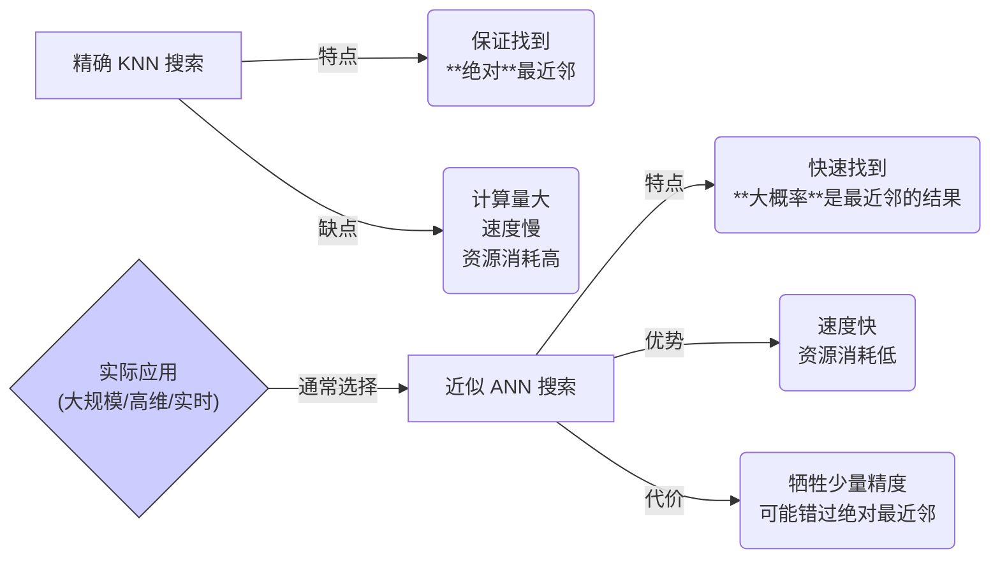

# 近似最近邻搜索 (Approximate Nearest Neighbor - ANN)

[[相似性搜索|返回 相似性搜索]] | [[../Core Technologies/向量数据库|相关: 向量数据库]]

## 概述

近似最近邻搜索 (Approximate Nearest Neighbor, ANN) 是一种在高维[[../../Fundamentals/向量 (Vector)|向量]]空间中**快速查找**与查询向量**近似**相似（距离最近）的邻居的算法。

与精确的 K 近邻 (Exact K-Nearest Neighbor, KNN) 搜索（需要计算查询向量与数据库中所有向量的距离，找到绝对最近的 K 个）相比，ANN 算法通过牺牲一定的**精度 (Accuracy)** 来换取极大的**速度 (Speed)** 提升和更低的**资源消耗**（内存、计算量）。

在处理[[../Core Technologies/向量数据库|向量数据库]]中数百万甚至数十亿级别的海量高维向量时，精确 KNN 搜索的计算成本过高，无法满足实时查询的需求，因此 ANN 成为了**实际应用中的标准方法**。

## 为什么需要 ANN？

*   **高维灾难 (Curse of Dimensionality)**: 在高维空间中，所有点之间的距离趋向于变得很大且相近，传统的空间索引结构（如 KD-Tree）效率急剧下降。精确查找所有点的距离变得非常耗时。
*   **数据规模**: 现代 AI 应用（如 [[../检索增强生成 (RAG)|RAG]] 的知识库）可能包含海量向量，无法对每个向量都进行精确计算。
*   **实时性要求**: 许多应用（如在线搜索、推荐、问答）需要毫秒级的响应速度。

## ANN 的核心思想：速度与精度的权衡

ANN 算法的核心思想是**避免全局搜索**，通过某种策略快速缩小搜索范围，找到“足够近”的邻居，而不是“绝对最近”的邻居。这种权衡通常是值得的，因为在很多应用场景下，找到语义上非常相似的几个结果通常就足够了，不一定非要找到理论上最相似的那一个。

## 常见的 ANN 算法类型

存在多种不同的 ANN 算法，各有优劣：

*   **基于树的方法 (Tree-based)**: 如 KD-Tree, Annoy。通过构建树状结构划分空间。在高维时效果下降。
*   **基于哈希的方法 (Hashing-based)**: 如 [[局部敏感哈希 (LSH)]]。通过设计哈希函数，让相似的向量有更高概率映射到同一个“桶”里，然后在同一个桶内搜索。
*   **基于图的方法 (Graph-based)**: 如 **HNSW (Hierarchical Navigable Small World)**。构建一个多层的邻近图，搜索时从顶层粗粒度的图开始，逐步导航到底层精细的图，找到最近邻。**HNSW 是当前非常流行且性能优异的 ANN 算法之一**。
*   **基于量化的方法 (Quantization-based)**: 如 IVF (Inverted File Index), PQ (Product Quantization)。通过聚类或向量压缩来减少需要比较的向量数量。IVF 将向量空间划分为多个区域（聚类中心），搜索时只查找查询向量所在区域及其附近区域的向量。

## 对产品经理的意义

*   **理解技术现实**: 知道在大规模向量搜索中，追求绝对精确通常不现实，ANN 是工程实践中的常用方案。
*   **关注性能指标**: 理解 ANN 涉及**速度（查询延迟 QPS）、精度（召回率 Recall）、内存占用**等多个指标的权衡。在定义产品需求时，需要考虑对这些指标的要求。
*   **评估技术方案**: 了解不同的 ANN 算法有不同的特点和适用场景，可以参与关于[[../Core Technologies/向量数据库|向量数据库]]或 ANN 算法选型的讨论。
*   **设定合理预期**: 向[[../沟通协作/利益相关者管理|利益相关者]]解释为什么搜索结果是“近似”相关的，而不是绝对完美的。

## 总结

ANN 是解决大规模高维向量[[相似性搜索|相似性搜索]]效率问题的关键技术。它通过牺牲少量精度换取速度和效率，是现代[[../Core Technologies/向量数据库|向量数据库]]和许多 AI 应用（如 [[../检索增强生成 (RAG)|RAG]]）的核心引擎。产品经理理解 ANN 的基本原理和其速度-精度的权衡，有助于设定合理的产品预期和评估相关技术方案。

## 相关概念

*   [[相似性搜索]]
*   [[K近邻 (KNN)]]
*   [[../Core Technologies/向量数据库|向量数据库]]
*   [[高维灾难]]
*   [[精度 (Accuracy/Recall)]]
*   [[速度 (Latency/QPS)]]
*   [[HNSW]], [[LSH]], [[IVF]] (具体 ANN 算法)
*   [[权衡 (Trade-offs)]]
