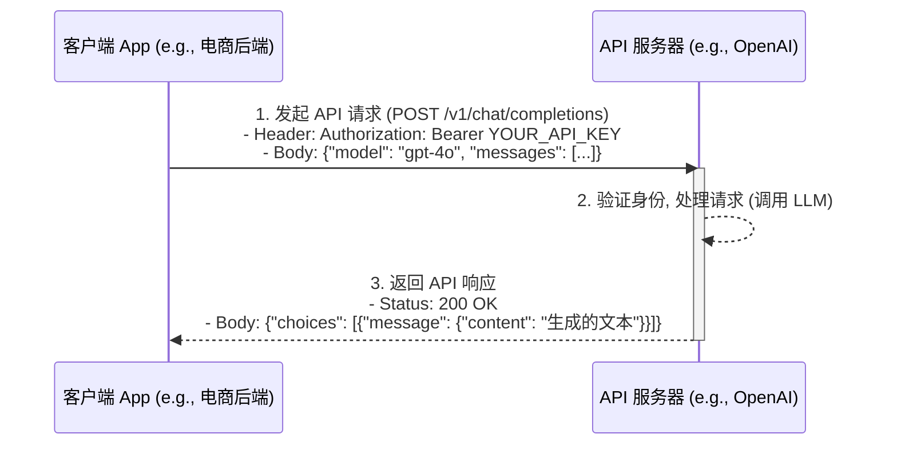

# API (应用程序接口)

[[00 - AI 与机器学习概览|返回 AI 概览]] | [[开源 vs 闭源模型|相关: 开源 vs 闭源模型]]

## 概述

API (Application Programming Interface)，即应用程序接口，是一组**预定义的规则、协议和工具**，允许不同的软件应用程序之间相互**通信和交互**。你可以把它想象成是软件服务提供商（例如 OpenAI, Google Cloud）提供给开发者（例如你公司的工程师）的一个“菜单”或“遥控器”，开发者可以通过这个菜单/遥控器来请求服务或数据，而不需要知道服务内部复杂的实现细节。

## API 的工作方式 (简化)

API 的交互通常遵循**请求-响应 (Request-Response)** 模式：

1.  **客户端 (Client)**: 需要使用某项服务的应用程序（例如，你的电商 App 后端）。
2.  **发起请求 (Request)**: 客户端按照 API 定义的**格式和协议**（通常是 HTTP/HTTPS），向指定的 **API 端点 (Endpoint)**（一个 URL 地址）发送请求。请求中通常包含：
    *   **方法 (Method)**: 如 GET (获取数据), POST (提交数据), PUT (更新数据), DELETE (删除数据)。
    *   **头部 (Headers)**: 包含元数据，如身份验证信息 (**API 密钥/令牌**)、内容类型等。
    *   **参数 (Parameters)**: （可选）附加信息，可以在 URL 中（查询参数）或请求体中（Body）。
    *   **请求体 (Body)**: （对于 POST/PUT 等）包含要发送的数据，通常是 JSON 格式。
3.  **服务器 (Server)**: 提供 API 服务的应用程序（例如，OpenAI 的服务器）。
4.  **处理请求**: 服务器接收到请求，验证身份，根据请求内容执行相应的操作（例如，调用 [[大型语言模型 (LLM)|LLM]] 生成文本）。
5.  **返回响应 (Response)**: 服务器将处理结果按照 API 定义的格式（通常是 JSON）返回给客户端。响应中通常包含：
    *   **状态码 (Status Code)**: 如 200 (成功), 400 (错误请求), 401 (未授权), 500 (服务器错误)。
    *   **头部 (Headers)**: 响应的元数据。
    *   **响应体 (Body)**: 包含请求的结果数据（例如，LLM 生成的文本、错误信息）。

## API 在 LLM 领域的应用

API 是使用**[[开源 vs 闭源模型|闭源 LLM]]** 的主要方式。公司如 OpenAI (GPT 系列), Anthropic (Claude 系列), Google (Gemini API) 等都提供了 API，允许开发者将这些强大的 LLM 集成到自己的应用程序中，而无需自己部署和维护庞大的模型。

**通过 LLM API 可以实现**:
*   文本生成
*   聊天对话
*   文本摘要
*   [[嵌入 (Embedding)|文本嵌入]] (将文本转换为向量)
*   ... 等等

**调用 LLM API 的关键考量**:
*   **成本**: 通常按输入和输出的 **Token 数量**（大致可理解为单词或字符块）收费，大规模使用成本可能很高。
*   **[[大型语言模型 (LLM)|延迟 (Latency)]]**: API 调用需要网络传输和服务器处理时间，可能存在延迟。
*   **速率限制 (Rate Limits)**: API 提供商通常会限制单位时间内的请求次数。
*   **[[技术相关/数据隐私|数据隐私]]**: 将用户数据发送给第三方 API，需要仔细评估提供商的隐私政策。
*   **可用性与稳定性**: 依赖第三方服务的稳定性。
*   **版本管理**: API 和底层模型会更新，需要关注版本兼容性。

## 对产品经理的意义

*   **理解技术实现方式**: 知道 API 是集成第三方服务（尤其是闭源 LLM）的主要方式。
*   **评估技术选型**: 参与讨论 [[开源 vs 闭源模型|API vs. 开源模型]]的利弊，理解 API 模式的优缺点（易用性、成本、控制权、隐私等）。
*   **成本意识**: 理解 API 调用是按量付费的，需要在产品设计中考虑成本效益。
*   **关注非功能性需求**: 关注 API 的延迟、速率限制、稳定性对[[产品设计/用户体验 (UX)|用户体验]]的影响。
*   **[[沟通协作/沟通技巧|沟通]]**: 能与工程师讨论 API 选择、集成方式、错误处理等问题。

## 总结

API 是现代软件开发的粘合剂，使得不同系统能够方便地交互。对于 LLM 领域，API 是使用强大闭源模型的主要途径。产品经理需要理解 API 的基本工作原理及其在 LLM 应用中的关键考量（成本、延迟、隐私等），以便在产品规划和技术选型中做出明智的决策。

## 相关概念

*   [[开源 vs 闭源模型|开源 vs 闭源模型]]
*   [[大型语言模型 (LLM)|大型语言模型 (LLM)]]
*   [[HTTP/HTTPS]]
*   [[JSON]]
*   [[身份验证]] (API Key/Token)
*   [[端点 (Endpoint)]]
*   [[请求-响应模式]]
*   [[延迟 (Latency)]]
*   [[速率限制]]
*   [[技术相关/数据隐私|数据隐私]]
*   [[技术选型]]
