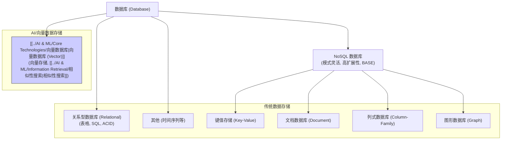

# 数据库 (Database)

## 概述

数据库 (Database, DB) 是一个**结构化的、持久化存储的数据集合**，通常由数据库管理系统 (Database Management System, DBMS) 进行管理。数据库使得数据的存储、检索、更新和管理更加高效和有组织。

## 数据库的主要类型

根据数据组织方式和特点，数据库可以分为多种类型：

1.  **关系型数据库 (Relational Database)**:
    *   **特点**: 基于**关系模型**，将数据存储在具有**行和列的二维表 (Table)** 中，表之间可以通过**键 (Key)** 建立关联。使用 **[[SQL (结构化查询语言)|SQL]]** 进行查询和操作。
    *   **优势**: 结构清晰，[[事务处理 (Transaction)]] (ACID特性) 成熟可靠，数据一致性高。
    *   **劣势**: 模式 (Schema) 相对固定，不易扩展，处理非结构化数据或超大规模数据可能效率不高。
    *   **代表**: MySQL, PostgreSQL, Oracle, SQL Server, SQLite。
2.  **NoSQL 数据库 (Not Only SQL)**:
    *   **特点**: 通常**不遵循严格的关系模型和固定的表结构**，设计用于大规模、高并发、模式灵活的应用场景。包含多种子类型：
        *   **键值存储 (Key-Value Store)**: 数据以简单的键值对形式存储。(如: Redis, Memcached)
        *   **文档数据库 (Document Database)**: 数据以类似 [[JSON]] 或 BSON 的**文档**形式存储，模式灵活。(如: MongoDB, Couchbase)
        *   **列式数据库 (Column-Family Store)**: 数据按列族存储，适合大规模聚合查询。(如: Cassandra, HBase)
        *   **图形数据库 (Graph Database)**: 专注于存储**节点和边**，高效处理实体间的复杂关系。(如: Neo4j, Nebula Graph)
    *   **优势**: 高可扩展性，高性能读写，模式灵活，适合半结构化和非结构化数据。
    *   **劣势**: 通常牺牲了部分一致性（遵循 BASE 原则而非 ACID），事务支持较弱。
3.  **[[../AI & ML/Core Technologies/向量数据库|向量数据库 (Vector Database)]]**:
    *   **特点**: **专门用于存储和高效查询高维[[向量 (Vector)|向量]]**，核心功能是[[../AI & ML/Information Retrieval/相似性搜索|相似性搜索]]（特别是[[../AI & ML/Information Retrieval/近似最近邻搜索 (ANN)|ANN]]）。
    *   **优势**: 在海量向量中进行快速语义相似性检索。
    *   **劣势**: 通常不适合存储和查询传统的结构化数据，功能相对专一。
    *   **代表**: Pinecone, Milvus, Weaviate, Qdrant, Chroma DB (以及带向量扩展的传统数据库如 PostgreSQL+pgvector)。
4.  **其他类型**: 时间序列数据库 (Time-Series DB), 搜索数据库 (Search Engine DB, 如 Elasticsearch) 等。

## 对产品经理的意义

*   **理解数据存储基础**: 知道数据是如何被组织和存储的。
*   **参与技术选型**: 能够与工程师讨论不同数据库类型在特定场景下的优劣势（例如：需要强一致性事务用关系型，需要灵活存储用户信息用文档型，需要语义搜索用向量型）。
*   **考虑数据需求**: 在设计功能时，考虑需要存储哪些数据，数据的结构如何，对查询性能的要求等。
*   **理解技术限制**: 了解不同数据库在扩展性、一致性、查询能力等方面的限制。

## 总结

数据库是现代应用的基础设施。了解不同数据库类型的特点和适用场景，有助于产品经理更好地理解系统架构，参与技术决策，并设计出能够有效利用数据的功能。特别是[[../AI & ML/Core Technologies/向量数据库|向量数据库]]，在当前 AI 应用（尤其是 [[../AI & ML/检索增强生成 (RAG)|RAG]]）中扮演着越来越重要的角色。

## 相关概念

*   [[数据 (Data)]]
*   [[数据库管理系统 (DBMS)]]
*   [[关系模型]]
*   [[表 (Table)]]
*   [[SQL (结构化查询语言)|SQL]]
*   [[事务处理 (Transaction)]] (ACID vs BASE)
*   [[NoSQL]]
*   [[JSON]]
*   [[../AI & ML/Core Technologies/向量数据库|向量数据库]]
*   [[技术架构]]
