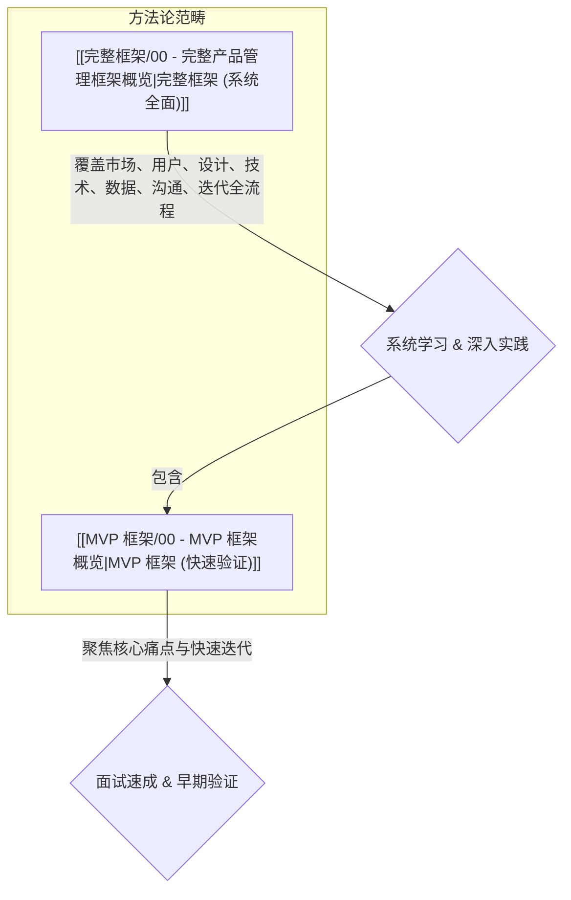

# 产品管理框架概览

## 概述

产品管理是一个涉及从概念到市场、再到持续迭代优化整个产品生命周期的复杂过程。为了系统性地思考和执行产品工作，业界发展出了多种框架。

本文档旨在概述两种核心的产品管理框架：
1.  **[[00 - MVP 框架概览|MVP（最小可行产品）框架]]**: 侧重于快速验证核心价值，适用于初期探索和面试速成。
2.  **[[00 - 完整产品管理框架概览|完整产品管理框架]]**: 覆盖更全面的产品管理流程，适用于系统学习和深入实践。

理解并灵活运用这些框架，能够帮助产品经理更清晰地定义问题、设计方案、衡量效果并推动产品成功。

## 框架对比

## 主要框架入口

*   [[00 - MVP 框架概览|进入 MVP 框架学习]]
*   [[00 - 完整产品管理框架概览|进入 完整产品管理框架学习]]
*   [[02 - 产品管理框架面试准备与深造|查看 面试准备与后续深造建议]]

## 相关概念

*   [[产品生命周期]]
*   [[敏捷开发]]
*   [[精益创业]]
*   [[产品战略]]
