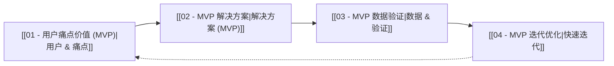

# MVP 框架概览

[[../00 - 产品管理框架概览|返回 产品管理框架概览]]

## 概述

MVP (Minimum Viable Product) 即 **最小可行产品**，是一种用于快速验证核心商业假设的产品开发策略。它包含刚好足够满足早期用户需求、并能提供反馈的核心功能集。

MVP 框架的核心思想是**快速学习和迭代**，避免在未经市场验证的功能上投入过多资源。这套思维框架尤其适用于**面试准备**，能够帮助你快速抓住产品经理思考问题的核心要点。

> **目标：** 能够在最短时间内理解并运用基本的PM理念，回答面试官问题时突出要点。

## MVP 4步法

1.  [[01 - 用户痛点价值 (MVP)|用户 → 痛点 → 价值]]
2.  [[02 - MVP 解决方案|解决方案 (MVP 版本)]]
3.  [[03 - MVP 数据验证|数据指标 & 验证]]
4.  [[04 - MVP 迭代优化|迭代优化]]

## 总结

MVP 框架提供了一个在面试时**最小可行**的回答思路。当面试官让你谈谈如何设计一个产品（例如AI电商聊天机器人）时，这4步足以让你结构清晰、抓住关键。

## 相关概念

*   [[完整框架/00 - 完整产品管理框架概览|完整产品管理框架]]
*   [[精益创业]] (`[[Lean Startup]]`)
*   [[用户访谈]]
*   [[A/B 测试]]
*   [[敏捷开发]]
