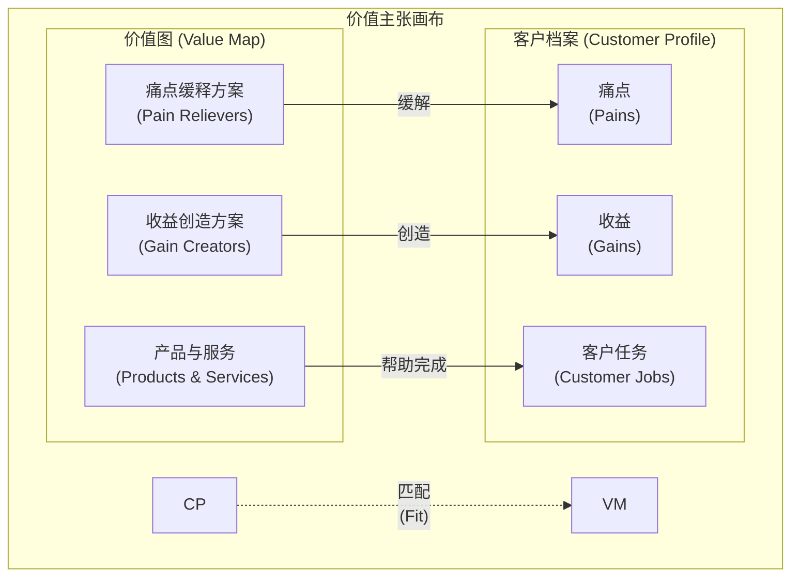

# 价值主张 (Value Proposition)

## 概述

价值主张是一个清晰、简洁的陈述，说明了你的产品或服务能为[[用户画像|目标用户]]带来什么**具体的价值**，以及为什么用户应该选择你而不是[[竞品分析|竞争对手]]。它是连接产品功能与用户需求的桥梁，是[[01 - 行业与市场认知|市场定位]]和[[产品战略]]的核心。

一个强有力的价值主张能够回答用户心中的关键问题：“我为什么要用/买这个产品？”

价值主张通常在[[02 - 用户需求分析|用户需求分析]]后提炼形成，并指导后续的[[产品设计/00 - 产品设计概览|产品设计]]和营销沟通。

## 核心要素

一个好的价值主张通常包含以下要素：

1.  **目标用户 (Target Customer)**: 清晰定义你的产品是为谁服务的。
2.  **用户需求/痛点 (Customer Need/Pain Point)**: 明确你要解决的用户核心问题或未满足的需求。
3.  **产品/服务名称 (Product/Service Name)**: 点明你的解决方案是什么。
4.  **核心价值/收益 (Key Benefit/Value)**: 清晰说明用户使用后能获得的主要好处（例如：省时、省钱、提高效率、获得愉悦、降低风险等）。这应该是具体的、可感知的。
5.  **差异化优势 (Differentiation)**: （可选但重要）说明相比[[竞品分析|竞争对手]]，你的独特之处是什么，为什么用户应该选择你。

## 价值主张画布 (Value Proposition Canvas)

这是一个常用的思考工具，由 Strategyzer 提出，帮助系统化地构建价值主张。它包含两部分：

*   **客户档案 (Customer Profile)**:
    *   **客户任务 (Customer Jobs)**: 用户想要完成的事情。
    *   **痛点 (Pains)**: 用户在完成任务时遇到的障碍和负面情绪。
    *   **收益 (Gains)**: 用户期望获得的结果和好处。
*   **价值图 (Value Map)**:
    *   **产品与服务 (Products & Services)**: 你提供的解决方案。
    *   **痛点缓释方案 (Pain Relievers)**: 你的产品如何减轻用户痛点。
    *   **收益创造方案 (Gain Creators)**: 你的产品如何帮助用户获得收益。

当价值图与客户档案能够良好匹配时，就形成了一个有效的价值主张。

## 示例：AI 电商助理 Rufus 的价值主张

*   **面向**: **经常网购、注重效率的消费者** ([[用户画像|目标用户]])
*   **他们遇到的问题是**: **查找商品信息费时、售后咨询等待时间长** ([[02 - 用户需求分析|痛点]])
*   **Rufus (AI 电商助理)** ([[产品名称]])
*   **能够**: **提供 7x24 小时即时、准确的商品问答和售后支持** ([[核心价值/收益]])
*   **与传统客服或自助查询相比**: **响应更快速、信息更聚合、体验更智能** ([[差异化优势]])

**简洁陈述**: “为注重效率的网购者提供 Rufus AI 助理，随时随地即时解答商品和售后疑问，告别等待，购物更轻松。”

## 总结

价值主张是产品战略的基石。产品经理需要深刻理解用户需求，并清晰地阐述产品如何满足这些需求、带来何种独特价值。在面试中，能够清晰表达产品的价值主张，是产品思维的重要体现。

## 相关概念

*   [[02 - 用户需求分析|用户需求分析]]
*   [[用户画像|用户画像]]
*   [[痛点|痛点]]
*   [[产品战略]]
*   [[市场定位|市场定位]]
*   [[竞品分析|竞品分析]]
*   [[电梯演讲]] (`[[Elevator Pitch]]`)
*   [[01 - 行业与市场认知|行业与市场认知]]
