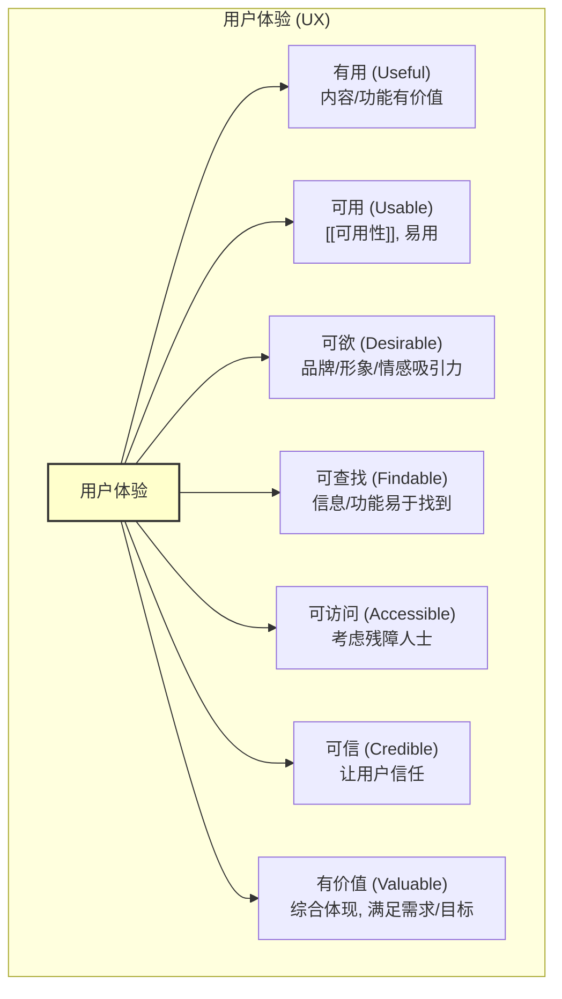

# 用户体验 (User Experience - UX)

## 概述

用户体验 (User Experience, UX) 是指用户在使用一个产品、系统或服务过程中的**整体感受和认知**。它是一个主观的、动态的、情境化的概念，涵盖了用户与产品交互的方方面面，包括情感、信念、偏好、认知、生理和行为反应等。

与侧重于“能否完成任务”的[[可用性]]相比，用户体验的范围更广，还包含了**有用性 (Utility)**、**可欲性 (Desirability)**、**可查找性 (Findability)**、**可访问性 (Accessibility)**、**可信性 (Credibility)** 等多个维度。目标是创造不仅能用，而且好用、爱用、有价值的产品体验。

## 用户体验蜂巢模型 (Peter Morville)

Peter Morville 提出的用户体验蜂巢模型 (User Experience Honeycomb) 形象地展示了构成良好用户体验的七个关键方面：

*   **有用 (Useful)**: 产品提供的功能或内容是否满足用户的实际需求？是否有用？
*   **可用 (Usable)**: 产品是否[[可用性|易于使用]]？用户能否高效、有效地完成任务？
*   **可欲 (Desirable)**: 产品的设计、品牌、形象、美感等是否能唤起用户的积极情感和拥有欲？
*   **可查找 (Findable)**: 用户能否轻松地找到他们需要的信息或功能？导航和[[信息架构]]是否清晰？
*   **可访问 (Accessible)**: 产品是否考虑到了不同能力的用户（如视障、听障人士），确保他们也能使用？（[[Web内容可访问性指南 (WCAG)]]）
*   **可信 (Credible)**: 产品和提供者是否值得用户信任？信息是否准确？[[../技术相关/数据隐私|隐私]]和[[../技术相关/数据安全|安全]]是否有保障？
*   **有价值 (Valuable)**: 产品是否最终为用户和提供者（企业）都创造了价值？它是否满足了最初的需求和目标？这是所有其他方面的综合体现。

## 用户体验设计 (UX Design)

用户体验设计是一个以[[用户中心设计]] (`[[User-Centered Design]]`) 为理念，旨在创造满足上述多维度要求的**整体产品体验**的过程。它涉及多个学科和环节：

*   **[[../用户研究/00 - 用户研究概览|用户研究]]**: 理解用户需求、[[../基础概念/痛点|痛点]]、行为和[[../基础概念/用户画像|画像]]。
*   **[[信息架构]] (IA)**: 组织和构建信息结构。
*   **[[交互设计]] (IxD)**: 设计用户与产品的互动方式和流程。
*   **[[用户界面设计]] (UI)**: 设计产品的视觉外观和感觉。
*   **[[内容策略]] (Content Strategy)**: 规划和创作有用的、可查找的、吸引人的内容。
*   **[[../用户研究/可用性测试|可用性测试]]与评估**: 验证和改进设计方案。

## 用户体验与产品管理

用户体验是产品成功的关键因素之一。产品经理需要：

*   **将用户体验置于核心地位**: 在产品规划和决策中始终考虑用户体验。
*   **与[[设计师]]紧密合作**: 理解设计师的思考过程，提供清晰的需求和[[../用户研究/00 - 用户研究概览|用户洞察]]，共同打磨产品体验。
*   **理解核心 UX 原则**: 了解基本的[[可用性]]原则、[[交互设计]]模式等。
*   **关注整体流程**: 不仅关注单个功能，更要关注用户完成任务的[[../产品设计/用户流程图|端到端流程]]体验。
*   **利用[[../数据分析与实验/00 - 数据分析概览|数据]]和[[../用户研究/用户反馈|反馈]]驱动体验优化**: 持续监测用户行为和满意度，发现体验问题并推动改进。

## 总结

用户体验 (UX) 是用户与产品交互的整体感受，涵盖可用性、有用性、可欲性等多个维度。打造卓越的用户体验需要跨学科的协作和以用户为中心的持续努力。理解并重视用户体验，是产品经理打造成功产品的必备素养。

## 相关概念

*   [[可用性]]
*   [[用户中心设计]] (`[[User-Centered Design]]`)
*   [[交互设计]] (IxD)
*   [[用户界面设计]] (UI)
*   [[信息架构]] (IA)
*   [[../用户研究/00 - 用户研究概览|用户研究]]
*   [[../基础概念/用户画像|用户画像]]
*   [[用户旅程图]]
*   [[服务设计]] (`[[Service Design]]`) (更宏观的体验设计)
*   [[../完整框架/03 - 产品设计与方案构思|产品设计与方案构思]]
