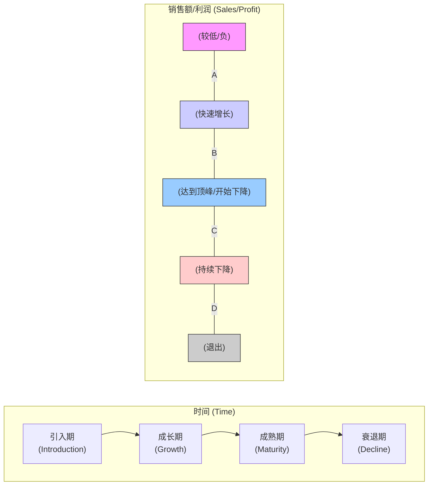

# 产品生命周期 (Product Lifecycle - PLC)

## 概述

产品生命周期 (Product Lifecycle, PLC) 是一个描述产品从**引入市场到最终退出市场**所经历的各个阶段的模型。理解产品当前所处的生命周期阶段，对于制定合适的[[../产品战略与规划/产品战略|产品战略]]、[[../市场与行业分析/市场定位|市场定位]]、[[定价策略]]、[[营销策略]]和[[../产品设计/功能优先级排序|功能优先级]]至关重要。

经典的产品生命周期模型通常包含以下四个（或五个）阶段。

## 产品生命周期的阶段

*(注：有时在引入期前会加上“开发期/Development”)*

1.  **引入期 (Introduction Stage)**
    *   **特征**: 新产品刚进入市场，[[知名度]]低，销售额增长缓慢，[[../数据分析与实验/转化率|用户获取成本]]高，可能处于亏损状态。[[../市场与行业分析/竞品分析|竞争]]者少。
    *   **目标**: 建立市场认知，吸引[[早期采用者 (Early Adopters)]]，验证[[../MVP 框架/00 - MVP 框架概览|产品市场契合度 (PMF)]]。
    *   **策略重点**:
        *   **产品**: 聚焦核心功能 ([[../MVP 框架/00 - MVP 框架概览|MVP]])，快速迭代，收集[[../用户研究/用户反馈|用户反馈]]。
        *   **定价**: 可能采用渗透定价（低价吸引用户）或撇脂定价（高价收回研发成本）。
        *   **营销**: 教育市场，建立品牌认知，针对[[早期采用者]]进行推广。
        *   **渠道**: 建立初步的分销渠道。

2.  **成长期 (Growth Stage)**
    *   **特征**: 产品被市场接受，销售额快速增长，[[用户规模]]扩大，[[利润]]开始增加并快速提升。[[../市场与行业分析/竞品分析|竞争]]者开始进入。
    *   **目标**: 最大化市场份额，建立品牌偏好，应对竞争。
    *   **策略重点**:
        *   **产品**: 改进产品质量，增加新功能，优化[[../产品设计/用户体验 (UX)|用户体验]]，开始考虑产品线延伸。
        *   **定价**: 维持价格稳定或略微下调以应对竞争。
        *   **营销**: 扩大市场宣传，建立品牌形象，强调产品优势。
        *   **渠道**: 拓宽分销渠道，提高市场覆盖率。

3.  **成熟期 (Maturity Stage)**
    *   **特征**: 市场增长放缓，销售额达到顶峰后可能缓慢下降，[[利润]]稳定或开始下降。市场趋于饱和，[[../市场与行业分析/竞品分析|竞争]]非常激烈，主要在现有品牌间争夺市场份额。
    *   **目标**: 维持市场份额，最大化利润，延长产品生命周期。
    *   **策略重点**:
        *   **产品**: 差异化！寻找细分市场，进行产品改进或开发新版本，加强品牌和服务。
        *   **定价**: 竞争性定价，可能通过促销降价。
        *   **营销**: 强调品牌差异和优势，维护用户[[忠诚度]]，鼓励用户转换竞争对手产品。
        *   **渠道**: 优化渠道效率，加强与渠道伙伴关系。

4.  **衰退期 (Decline Stage)**
    *   **特征**: 市场萎缩，销售额和利润持续下降。技术替代、用户偏好改变等导致产品过时。
    *   **目标**: 控制成本，榨取剩余价值，或平稳退出市场。
    *   **策略重点**:
        *   **产品**: 削减产品线，停止投入研发，只保留核心盈利版本。
        *   **定价**: 大幅降价清库存。
        *   **营销**: 大幅削减营销费用，只针对核心忠实用户。
        *   **渠道**: 收缩渠道，选择性放弃。
        *   **决策**: 考虑**收割 (Harvest)** 策略（只求短期利润）或**退出 (Divest)** 策略（出售或停止产品）。

## 产品生命周期的重要性

*   **战略指导**: 不同阶段需要不同的产品、营销、定价和渠道策略。
*   **资源分配**: 指导研发、营销等资源的投入重点。
*   **风险预警**: 帮助预测市场变化和竞争态势。
*   **创新驱动**: 促使企业在成熟期和衰退期前寻求新的增长点或进行产品迭代。

## 局限性

*   **预测困难**: 难以精确判断产品处于哪个阶段以及每个阶段会持续多久。
*   **形态各异**: 不同类型的产品生命周期曲线形态差异很大（例如：时尚类产品可能周期很短，经典产品可能成熟期很长）。
*   **策略影响**: 企业自身的战略决策可以影响甚至改变产品生命周期的进程。

## 总结

产品生命周期是一个经典且重要的战略分析工具。产品经理需要理解其概念，能够大致判断产品所处的阶段，并结合实际情况制定相应的策略。在面试中，讨论你对目标产品生命周期阶段的判断以及对应的策略思考，能体现你的战略眼光。

## 相关概念

*   [[../产品战略与规划/产品战略|产品战略]]
*   [[../市场与行业分析/市场定位|市场定位]]
*   [[定价策略]]
*   [[营销策略]]
*   [[../MVP 框架/00 - MVP 框架概览|产品市场契合度 (PMF)]]
*   [[早期采用者]]
*   [[../市场与行业分析/竞品分析|竞品分析]]
*   [[差异化]]
*   [[../完整框架/00 - 完整产品管理框架概览|完整产品管理框架]] (各阶段策略)
