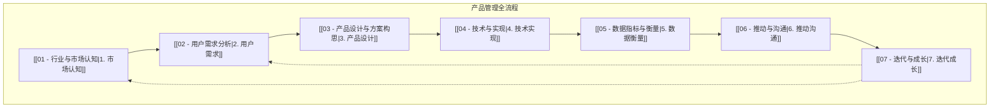

# 完整产品管理框架概览

[[../00 - 产品管理框架概览|返回 产品管理框架概览]]

## 概述

与侧重快速验证的 [[MVP 框架/00 - MVP 框架概览|MVP 框架]]相比，这套**完整产品管理框架**更加系统和全面。它覆盖了从市场洞察到产品迭代的全生命周期，旨在帮助产品经理更深入地理解职责、流程和所需能力。

这套框架适合在掌握了 MVP 思维后，进行**系统学习和深入实践**，也能够在面试中展现你对产品管理工作的**深度和广度**。

> **目标：** 在具备“MVP”思维的基础上，知道如何覆盖更多PM职责与流程，帮助你在面试和后续工作中胜任更复杂的需求与挑战。

## 完整框架 7 步法

1.  [[01 - 行业与市场认知|行业与市场认知]]
2.  [[02 - 用户需求分析|用户需求分析]]
3.  [[03 - 产品设计与方案构思|产品设计与方案构思]]
4.  [[04 - 技术与实现|技术与实现]]
5.  [[05 - 数据指标与衡量|数据指标与衡量]]
6.  [[06 - 推动与沟通|推动与沟通]]
7.  [[07 - 迭代与成长|迭代与成长]]

## 总结

这个完整的流程，可以让你在面试中“进可攻、退可守”：
*   如果时间紧，你可以快速抓住 [[MVP 框架/00 - MVP 框架概览|MVP 框架]] 的核心部分回答。
*   如果面试官深入追问，你还能基于这个框架展开更多专业细节和思路。

## 相关概念

*   [[MVP 框架/00 - MVP 框架概览|MVP 框架]]
*   [[产品生命周期]]
*   [[产品战略]]
*   [[产品路线图]]
*   [[跨职能团队]]
*   [[../../Interview Simulation/Product Manager Interview/02 - 产品管理框架面试准备与深造|面试准备与深造]]
