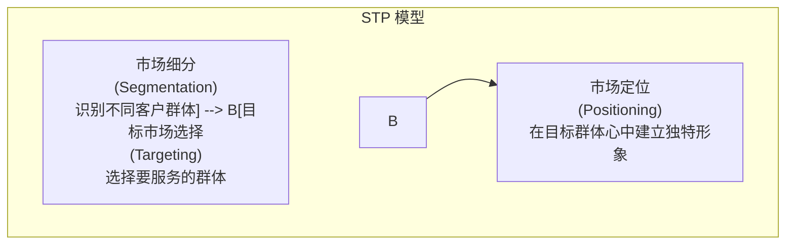

# 市场定位 (Market Positioning)

## 概述

市场定位 (Market Positioning) 是指企业根据[[../市场与行业分析/竞品分析|竞争者]]在市场上的位置，结合自身[[资源]]和[[../市场与行业分析/SWOT 分析|优势]]，为自己的产品或品牌在**[[../基础概念/用户画像|目标消费者]]心智中**创造一个**清晰、独特、有价值且令人向往的位置**的过程和结果。

定位的核心目的是回答：
1.  **我们为谁服务？ (Target Audience)** - [[目标市场]]和[[../基础概念/用户画像|用户画像]]是谁？
2.  **我们提供什么独特的价值？ (Unique Value Proposition)** - 相比[[../市场与行业分析/竞品分析|竞争对手]]，我们的[[../产品战略与规划/价值主张|核心价值]]和[[差异化]]优势是什么？
3.  **我们希望用户如何看待我们？ (Desired Perception)** - 我们想在用户心中建立什么样的形象和认知？

市场定位是[[../产品战略与规划/产品战略|产品战略]]和[[营销策略]]的基石，它指导着产品开发、定价、渠道和推广等所有活动，确保传递给市场的信息是一致且有力的。

## 市场定位的步骤 (STP 模型)

市场定位通常是经典的 **STP 营销战略模型** 的最后一步：

1.  **市场细分 (Segmentation)**:
    *   将整个市场按照某种标准（如人口统计特征、地理位置、心理特征、行为习惯、需求偏好等）划分为若干个具有相似特征和需求的**子市场 (Segment)**。
    *   目标是识别出不同的潜在客户群体。
2.  **目标市场选择 (Targeting)**:
    *   评估各个细分市场的吸引力（如市场规模、增长潜力、盈利能力、竞争激烈程度）。
    *   结合企业自身的[[资源]]、能力和[[../产品战略与规划/产品战略|战略目标]]，选择一个或多个**最有价值、最适合进入的细分市场**作为目标市场。
3.  **定位 (Positioning)**:
    *   针对选定的目标市场，设计公司的产品/服务及其形象，以便在目标顾客心中**占据一个独特且有价值的位置**。
    *   这涉及到明确产品的[[../产品战略与规划/价值主张|核心价值]]和[[差异化]]优势，并将其有效地传达给目标客户。

## 定位策略的关键要素

*   **目标客户 (Target Customer)**: 清晰定义你的理想客户是谁。
*   **市场类别 (Market Category)**: 你所属的产品或服务类别是什么？（例如：即时通讯软件、在线视频平台、AI 驱动的写作助手）。这为用户提供了认知框架。
*   **关键差异点 (Point of Difference - POD)**: 相比[[../市场与行业分析/竞品分析|竞争对手]]，你**独特**的、**优越**的、且对目标客户**有意义**的价值点是什么？这是定位的核心。差异点可以基于：
    *   **功能属性**: 特定的功能、性能、技术。
    *   **利益**: 为用户带来的具体好处（省时、省钱、方便、愉悦等）。
    *   **价格/质量**: 性价比、高端、经济实惠。
    *   **用户形象**: 产品与特定用户身份或生活方式的关联。
    *   **品牌情感**: 品牌带来的感觉和联想。
*   **支撑点 (Reasons to Believe)**: 为什么用户应该相信你的差异点？需要有事实、证据或功能来支撑你的定位声明。

## 定位声明 (Positioning Statement)

定位声明是一个简洁的内部文档，用于清晰地阐述产品的市场定位，指导团队行动。它通常遵循一个模板，例如：

> **对于 [目标客户群体]，[你的产品/品牌名称] 是 [市场类别] 中，能够提供 [关键差异点/核心价值] 的 [产品/品牌]。这是因为 [支撑点/理由]。**

**示例 (假设的 AI 电商助理 Rufus)**:

> **对于** [追求高效购物体验的年轻在线消费者]，**Rufus** 是 [AI 电商助理] 中，能够 **提供最快速、最准确的 7x24 小时商品及售后问答服务** 的 **智能助手**。**因为** 它基于先进的 [[../技术相关/LLM|LLM]] 技术，并深度整合了实时商品和订单数据。

## 定位的重要性

*   **指导产品开发**: 确保产品功能与定位一致，强化核心差异点。
*   **引领营销沟通**: 确保广告、公关、内容营销等传递一致的核心信息。
*   **建立品牌形象**: 在用户心中形成清晰独特的认知。
*   **提升竞争力**: 通过差异化避免同质化竞争。
*   **统一团队认知**: 让内部团队对产品的核心价值和目标用户有共同理解。

## 总结

市场定位是连接产品与市场的关键环节。产品经理需要深刻理解目标用户和竞争环境，找到并清晰传达产品的独特价值主张，从而在用户心智中占据有利位置。成功的定位能够为产品带来强大的竞争优势。

## 相关概念

*   [[市场细分]]
*   [[目标市场]]
*   [[../基础概念/用户画像|用户画像]]
*   [[../产品战略与规划/价值主张|价值主张]]
*   [[差异化]]
*   [[../市场与行业分析/竞品分析|竞品分析]]
*   [[品牌战略]]
*   [[营销策略]]
*   [[定位声明]]
*   [[../完整框架/01 - 行业与市场认知|行业与市场认知]]
*   [[../产品战略与规划/产品战略|产品战略]]
