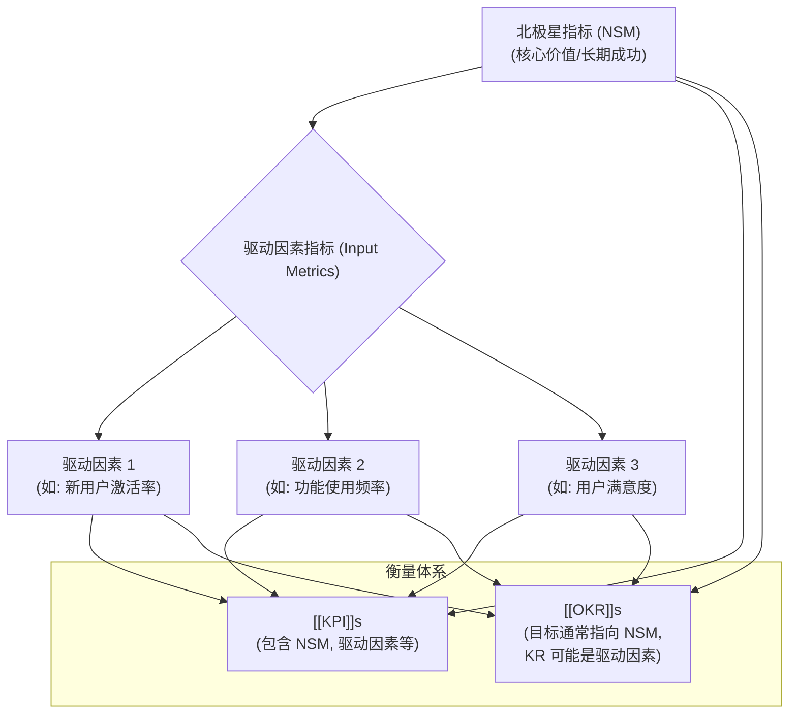

# 北极星指标 (North Star Metric - NSM)

[[00 - 数据分析概览|返回 数据分析概览]]

## 概述

北极星指标 (North Star Metric, NSM) 是一个**单一的、关键的衡量标准**，它最好地体现了产品为客户创造的**核心[[../产品战略与规划/价值主张|价值]]**。这个指标应该能够**预测公司长期的商业成功**，并为整个团队（产品、工程、营销等）提供一个**统一的、可追溯的指引方向**，就像北极星为航海者导航一样。

选择正确的北极星指标对于确保团队聚焦于真正重要的事情、避免[[虚荣指标]] (Vanity Metrics) 至关重要。它通常是[[../完整框架/05 - 数据指标与衡量|数据指标与衡量]]体系中的顶层指标。

## 好的北极星指标的特征

一个有效的北极星指标通常具备以下特征 (参考 Amplitude 的总结)：

1.  **体现用户价值 (Measures Customer Value)**: 它应该直接反映用户从产品中获得的核心价值。当用户从产品中获益时，指标应该增长。
2.  **代表产品战略 (Represents Product Strategy)**: 它与产品的核心[[../产品战略与规划/产品战略|战略]]和[[../基础概念/产品愿景|愿景]]紧密相关。
3.  **领先指标 (Leading Indicator)**: 它应该能够预测未来的[[营收]]或商业成功，而不是滞后指标（如月度营收）。理想情况下，它的提升会带来未来收入的增长。
4.  **可行动 (Actionable)**: 团队应该能够通过改进产品或运营活动来直接影响这个指标。
5.  **可理解 (Understandable)**: 指标应该易于团队成员理解和记忆。
6.  **可衡量 (Measurable)**: 能够通过数据可靠、持续地进行追踪。
7.  **不应是虚荣指标 (Not a Vanity Metric)**: 它不应是一个看起来很好但与业务成功关联不大的指标（例如：单纯的注册用户数、页面浏览量）。

## 如何找到北极星指标？

寻找北极星指标没有固定公式，需要深入理解业务和用户。可以思考以下问题：

*   用户使用我们产品的**核心目的是什么？** (What is the essential value users get?)
*   什么指标最能体现用户**成功地**获得了这种核心价值？
*   哪些用户行为与**长期留存和商业成功**最相关？
*   如果这个指标提升了，是否意味着我们的业务在**健康地增长**？

通常需要结合[[../用户研究/00 - 用户研究概览|用户研究]]、[[../数据分析与实验/00 - 数据分析概览|数据分析]]（特别是[[../数据分析与实验/留存分析|留存分析]]、[[../数据分析与实验/用户分群|用户行为分析]]）和对[[商业模式]]的理解来确定。

## 北极星指标示例

| 公司/产品类型        | 可能的北极星指标 (示例)                     | 核心价值体现                         |
| :----------------- | :------------------------------------------ | :--------------------------------- |
| 社交网络 (Facebook)  | 月活跃用户数 (MAU)                          | 连接人与人                           |
| 电商平台 (Amazon)    | 每月购买用户数 / Prime 会员数                | 便捷购物 / 会员权益                   |
| 内容平台 (Spotify)   | 总收听时长 / 付费订阅用户数                 | 发现和享受音乐                       |
| 协作工具 (Slack)     | 每周发送消息达到一定数量的团队数 (Engaged Teams) | 提升团队沟通效率                     |
| 短租平台 (Airbnb)    | 预订间夜数 (Nights Booked)                  | 连接房东与旅行者                     |
| **AI 电商助理 (假设)** | **用户通过 AI 成功解决问题的次数/月**        | 提升购物咨询效率，解决用户疑问       |
| **AI 电商助理 (假设)** | **AI 驱动的 GMV (成交总额)**               | 通过智能推荐和引导促进销售           |

*注意：选择哪个 NSM 取决于产品的具体阶段和战略重点。例如，对于初期的 AI 助理，可能更关注问题解决效率；对于成熟期，可能更关注其对 GMV 的直接贡献。*

## 北极星指标与 [[KPI]] / [[OKR]] 的关系

*   **NSM** 是顶层的、指引方向的核心价值指标。
*   **[[KPI]] (关键绩效指标)** 是追踪业务健康度和进度的具体量化指标，可以有多个，可能包含 NSM 或其驱动因素。
*   **[[OKR]] (目标与关键结果)** 是一种目标设定框架，通常服务于 NSM 的提升。一个 OKR 的目标可能就是提升 NSM，其 KR 则是达成该目标的具体、可衡量的里程碑，这些 KR 可能是 NSM 的驱动因素指标。

## 总结

北极星指标是产品战略的核心，它帮助团队聚焦于为用户创造核心价值，并指引产品向正确的方向发展。产品经理需要深入思考和定义适合自己产品的北极星指标，并围绕它构建衡量体系和[[../数据分析与实验/OKR|OKR]]。在面试中，讨论你对目标产品北极星指标的思考，能展现你的战略思维和[[数据驱动决策]]能力。

## 相关概念

*   [[../完整框架/05 - 数据指标与衡量|数据指标与衡量]]
*   [[../产品战略与规划/价值主张|价值主张]]
*   [[产品战略]]
*   [[KPI]]
*   [[OKR]]
*   [[虚荣指标]]
*   [[领先指标 vs 滞后指标]]
*   [[数据驱动决策]]
