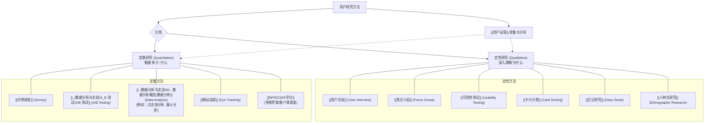

# 用户研究概览

## 概述

用户研究 (User Research) 是系统性地了解目标用户的需求、行为、态度和使用场景的过程。它是[[../完整框架/02 - 用户需求分析|用户需求分析]]的核心环节，为产品设计、开发和迭代提供关键的洞察和依据，确保产品真正以用户为中心。

用户研究贯穿[[../基础概念/产品生命周期|产品生命周期]]的各个阶段，从早期的概念探索到后期的体验优化都需要进行。

## 用户研究的目标

*   **发现需求与机会**: 理解用户的[[../基础概念/痛点|痛点]]、未满足的需求和潜在期望。
*   **验证假设**: 验证关于用户、市场或产品设计的假设。
*   **评估产品**: 评估现有产品或原型的[[可用性]]、[[用户体验]]和价值。
*   **了解用户**: 深入了解用户的行为模式、心智模型和决策过程。
*   **建立[[../基础概念/用户画像|用户画像]]**: 为目标用户群体创建典型代表。

## 主要用户研究方法

用户研究方法众多，通常分为**定性研究 (Qualitative)** 和 **定量研究 (Quantitative)** 两大类。

*   **定性研究**: 侧重于深入理解用户的观点、感受和行为背后的原因。样本量较小，但信息深度高。常用方法包括 [[用户访谈]]、[[可用性测试]]、[[焦点小组]]等。
*   **定量研究**: 侧重于收集可量化的数据，以统计分析的方式了解用户行为的广度、频率和模式。样本量较大。常用方法包括 [[问卷调查]]、[[../数据分析与实验/A_B 测试|A/B 测试]]、[[../数据分析与实验/00 - 数据分析概览|网站/App 数据分析]]等。

## 用户研究流程 (简化)

1.  **定义目标**: 明确研究要回答的问题和要验证的假设。
2.  **选择方法**: 根据研究目标选择合适的定性或定量方法。
3.  **招募用户**: 筛选符合[[../基础概念/用户画像|目标用户画像]]的参与者。
4.  **执行研究**: 实施访谈、测试、发放问卷等。
5.  **分析数据**: 整理、分析收集到的定性和定量数据，提炼洞察。
6.  **产出报告**: 将研究发现、结论和建议进行总结和汇报。

## 总结

有效的用户研究是打造成功产品的基础。它帮助团队避免主观臆断，将用户的真实声音融入产品决策。在面试中，展现你对用户研究方法和价值的理解，以及如何运用研究结果指导产品实践，是非常重要的加分项。

## 相关概念

*   [[../完整框架/02 - 用户需求分析|用户需求分析]]
*   [[../基础概念/用户画像|用户画像]]
*   [[用户访谈]]
*   [[可用性测试]]
*   [[问卷调查]]
*   [[用户反馈]]
*   [[定性研究 vs 定量研究]]
